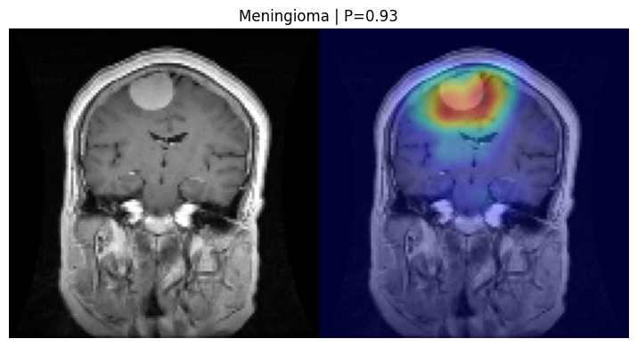

# MA-MSCNet-BrainTumor
MA-MSCNet: Morphology-Aware Multi-Scale CNN for explainable brain tumor classification from MRI, integrating morphological operators and Grad-CAM for interpretable predictions.

# MA-MSCNet: Morphology-Aware Multi-Scale CNN for Explainable Brain Tumor Classification

[](YOUR_NOTEBOOK_LINK)

---

##  Overview

This repository provides a reproducible and interpretable demonstration of **MA-MSCNet**, a lightweight morphology-aware convolutional neural network designed for multi-class brain tumor classification from MRI images.

The framework integrates:
- Multi-scale feature extraction  
- Trainable morphological operators (dilation and erosion)  
- Visual interpretability using Grad-CAM  

This repository focuses on **model inference and explainability**, enabling users to explore how the model makes predictions on MRI data.

---

##  Key Contributions

- **Morphology-aware feature learning** using trainable dilation and erosion layers  
- **Multi-scale CNN architecture** for capturing tumor structures at different resolutions  
- **Lightweight design** suitable for efficient inference  
- **Explainability via Grad-CAM**, highlighting discriminative regions  

---

##  Repository Structure
MA-MSCNet-BrainTumor/

colab/
   MA-MSCNet_Demo.ipynb
sample_images/
   glioma_01.jpg
   glioma_02.jpg
   meningioma_01.jpg
   meningioma_02.jpg
   notumor_01.jpg
   notumor_02.jpg
   pituitary_01.jpg
   pituitary_02.jpg
figures/
   gradcam_example.png
   feature_maps_example.png
requirements.txt
LICENSE
README.md
---

## Quick Start

The easiest way to run the demo is via Google Colab:

1. Click the **Open in Colab** badge above  
2. Run all cells sequentially  
3. The notebook will:
   - Automatically download the pretrained model  
   - Load sample MRI images  
   - Perform classification  
   - Generate Grad-CAM visualizations  

---

## Pretrained Model

Due to GitHub file size limitations, the pretrained MA-MSCNet model is hosted on Google Drive and automatically downloaded within the notebook.

- No manual download required  
- Fully reproducible setup  

---

## Example Output

The model produces both predictions and visual explanations:

- Input MRI image  
- Predicted class with confidence score  
- Grad-CAM heatmap highlighting important regions  

```markdown

